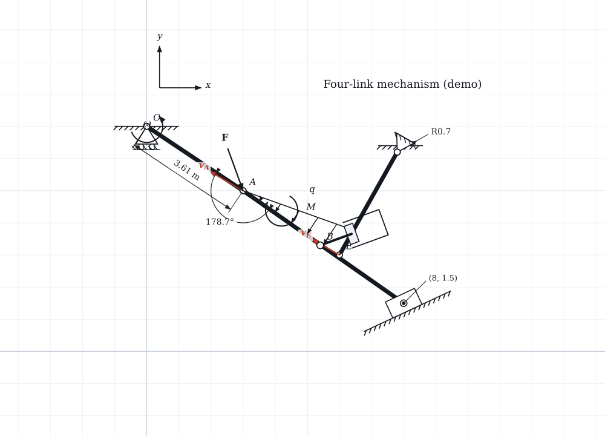

# ⛑ Helmet CAD

A simple **2D Computer-Assisted-Design / drafting tool** for theoretical-mechanics
schematics — statics "free-body" diagrams and kinematics mechanism diagrams like
the reference PDFs (`Dvieju_kunu_sistema`, `Kinematikos`). Think *SolidWorks
sketch mode, but 2D-only and stripped down to just what you need to draft a
document*: spawn prefab objects, drag them into place, tweak their dimensions,
and annotate with Smart Dimensions.

> Built with Electron + an SVG drawing engine. It also runs in a plain browser.



## Run it

**Easiest — just open the file.** Download **[`helmet-cad.html`](helmet-cad.html)**
and double-click it. It's a single self-contained file (no install, no server,
works offline) — the whole app bundled into one HTML.

**Desktop (Electron):**
```bash
npm install        # installs electron
npm start
```

**Browser via local server:**
```bash
npm run web        # serves at http://localhost:5173
```

**Rebuild the standalone file** after editing `app/`:
```bash
npm run build      # regenerates helmet-cad.html
```

## How it works

- **Left panel — Prefab palette.** Click a prefab, then click on the canvas to
  place it. A translucent **ghost preview** follows the cursor so you see what
  you're about to drop. Single-click prefabs drop in one spot; multi-click ones
  let you set endpoints (e.g. a *Link* = 2 clicks, an *Angular dimension* =
  3 clicks: vertex, arm 1, arm 2). Press **Esc** to finish/cancel and return to
  Select.
- **Mate-to-link.** Hover a *slider-in-slot*, *roller* or *pin support* over a
  link and it snaps **onto** the bar and orients to it live (the target link is
  highlighted) — the slider slides *along* the bar, supports stand
  *perpendicular*. It's just a starting point; every value stays editable.
- **Canvas — Draft here.** Pan with middle-mouse or **Space-drag**, zoom with the
  wheel. The cursor **snaps** to joints, endpoints and the grid (orange marker).
- **Right panel — Properties.** Select an object to edit every dimension/parameter
  (length, angle, thickness, radius, labels, colors…). Drag the blue square
  **handles** on a selected object to reshape it directly.

### Prefab library

| Category | Objects |
|---|---|
| **Structure** | Pin joint, Link/bar, Piston / cylinder |
| **Supports** | Fixed wall (ground hatch), Pin support (hinge), Roller support, Slider-in-slot |
| **Loads** | Force (point load), Distributed load (uniform / triangular), Moment |
| **Vectors** | Vector (v / a), Angular velocity ω, Coordinate axes |
| **Dimensions** | Linear, Angular, Radius / diameter, Coordinate |
| **Annotation** | Text label |

### Smart Dimension

The four dimension prefabs measure live geometry and show editable values:

- **Linear** — distance with extension lines + arrows; set unit & decimals, or
  override the text.
- **Angular** — angle between two surfaces/arms shown as an arc in degrees.
- **Radius / diameter** — leader + `R` or `⌀` value.
- **Coordinate** — a point's `(x, y)`.

### Blueprint mode

Click **Blueprint** (or `Ctrl+B`) to publish the draft onto a formatted sheet:

- **Pick a sheet** — A0–A4 (ISO) or Letter (ANSI A), landscape/portrait, with a
  live size preview (the *Sheet Format / Size* dialog).
- **Border + zone marks + title block** — numbered/lettered zones and a title
  block you fill from the side panel: *Title, Drawn by, Organisation, Date, Dwg
  no., Scale, Revision, Sheet* (Size is taken from the format).
- **Select** — click a part to select it, **box-select** several by dragging on
  empty paper (Shift adds), or *Select all*. *Esc* deselects.
- **Move / separate parts** — drag a selected part (or group) to pull it out and
  show it off (e.g. separating a linkage into its bodies for calculations).
- **Scale** — three ways:
  - **Global** scales the whole drawing (number box, ± buttons, or *Shift+wheel*)
    so you can shrink it and free up room to arrange details.
  - **Label size** scales all labels & dimension text *with* the drawing (so they
    don't dominate when scaled); auto-set from the drawing size, tweakable.
  - **Single item** — select one and drag a corner of its box (or *Scale ±* / the
    `+`/`-` keys).
  - **Several at once** — box-select a subset and scale them together about their
    common centre.
  All of this is **non-destructive**: only per-part offset + scale are stored, so
  your working draft is never modified. *Fit drawing* and *Reset layout* revert.
- **Export** — *Print / PDF* (opens a true-to-size print page), or download
  **SVG** / **PNG**. The sheet is emitted in real millimetres so it prints to
  scale.
- The sheet + title block + layout are saved inside the `.hcad.json` project.

### Files

- **Save / Open** native `*.hcad.json` project files (Ctrl+S / Ctrl+O). In the
  browser these become download / upload.
- **Blueprint** (Ctrl+B) is a reserved slot for the next feature — a printable
  sheet with border + title block and PDF/SVG export. The engine already renders
  to vector world-space, so it can wrap the current scene unchanged.

## Keyboard

| | |
|---|---|
| Select / move | default tool |
| Pan | middle-drag or Space-drag |
| Zoom | wheel · `Ctrl+0` fit · `Ctrl +/-` |
| Undo / Redo | `Ctrl+Z` / `Ctrl+Shift+Z` |
| Delete · Duplicate · Select all | `Del` · `Ctrl+D` · `Ctrl+A` |
| Draw order | `]` forward · `[` backward · `Shift+]` front · `Shift+[` back (also in Properties ▸ Arrange) |
| Toggle grid · snap | `G` · `Ctrl+Shift+G` |
| Finish / cancel placement | `Esc` |

## Project layout

```
main.js / preload.js   Electron shell, menus, native Save/Open
serve.js               tiny static server for the browser mode
app/index.html,css     UI shell
app/js/
  geometry.js          vector math + snapping helpers
  camera.js            pan/zoom world↔screen transform
  renderer.js          SVG "pen" (world-space drawing primitives) + grid
  entities.js          parametric prefab definitions (draw/handles/params)
  prefabs.js           palette catalog
  store.js             document model + undo/redo + save/load
  tools.js             pointer tools: select / move / handles / place / snap
  panels.js            palette + properties UI
  blueprint.js         reserved stub for the future Blueprint feature
  main.js              app bootstrap & event wiring
```
